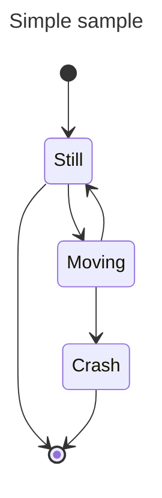

# rink-hockey-engine
Scoreboard engine for rink hockey (on roller skates)

## Overview

This is a state machine that encapsulates the logic of a rink hockey scoreboard.

## Events

Events are fired from screen/button/user inputs and appended to the event list/log/table/etc.

## State

The current state (eg: scores, clock status, etc) is derived from the list of events.

# Components

- Game clock
    - Enabled?
    - Pause
    - Resume
    - Set time
- Shot clock
    - Enabled?
    - Pause
    - Resume
    - Reset
    - Set time
- Scores
- Tower
    - Enabled?
    - Time-out request
    - Team foul
- Fouls
    - Enabled?
- Period / half
    - Enabled?
- Players
    - Enabled?
    - Scores
    - Fouls/warnings
    - States

# Roles / Responsibilities / Features / Scenarios / Steps

## Roles

### Floor Referees

Officiates the match.

#### Call penalty after 10 team fouls

- Tower

### Extra Referees

### Time-keeper

- Game clock

### Scorer

- Team scores
- Team fouls

### Players

- See match time
- See times scores

### Calculator

# Example events

| time | event |
| ---- | ----- |
|      | initialisation |
| 0:00 | start match |
| 0:15 | stop clock |
| 0:18 | resume clock |
| 1:23 | home score increment |
| 1:24 | home score decrement |
|      | away team foul increment |
|      | away team foul decrement |
|      | match report |

